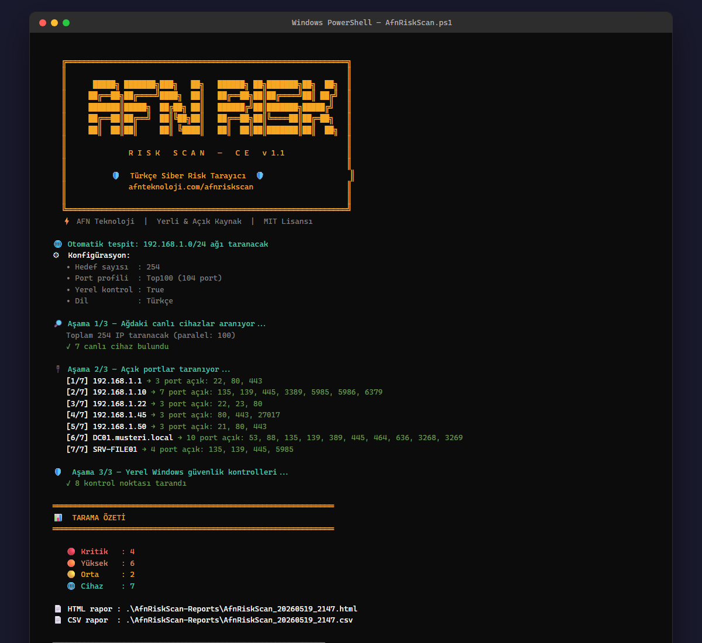
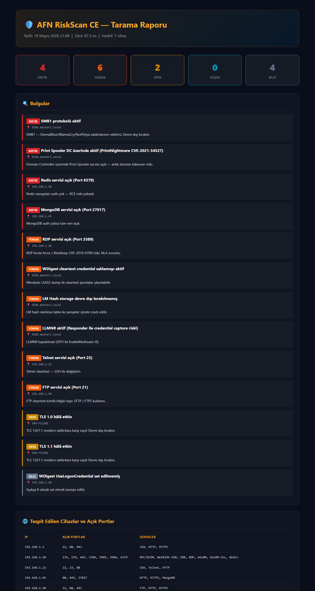
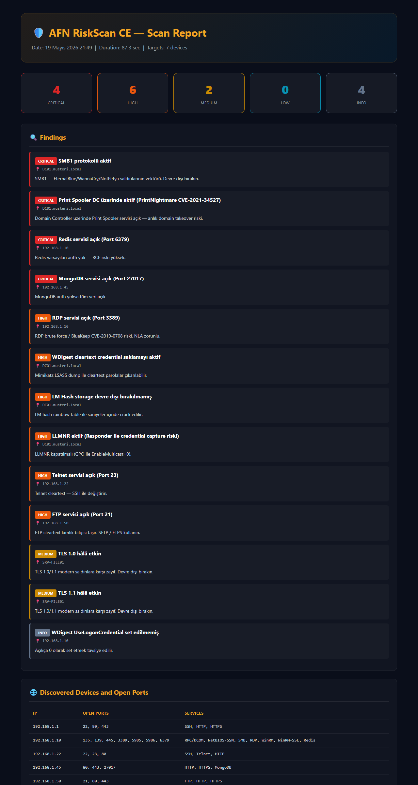

<div align="center">

# 🛡️ AFN RiskScan — Community Edition

### Türkçe Siber Risk Tarayıcı  •  Turkish Cyber Risk Scanner

[](https://github.com/Afn-Teknoloji/AfnRiskScan-CE/stargazers)
[](https://github.com/Afn-Teknoloji/AfnRiskScan-CE/releases)
[](LICENSE)
[](https://learn.microsoft.com/en-us/powershell/scripting/install/installing-powershell-on-windows)
[](https://afnteknoloji.com)

**🇹🇷 Türkçe** &nbsp;•&nbsp; [**🇬🇧 English**](#-english)

[🌐 AfnRiskScan CE Tanıtım Sayfası](https://risktarama.com.tr/afnriskscan-ce) &nbsp;•&nbsp;
[📊 Örnek Siber Risk Raporu](https://risktarama.com.tr/ornek-rapor) &nbsp;•&nbsp;
[🚀 Pro Demo Talep Et](https://risktarama.com.tr/#contact)

</div>

---

## 📸 Ekran Görüntüleri / Screenshots

<div align="center">

### 🖥️ Konsol Çıktısı / Console Output


### 📊 HTML Rapor — Türkçe


### 📊 HTML Report — English


</div>

---

## 🇹🇷 Türkçe

**Bir komutla** ağınızdaki cihazları keşfedin, açık portları bulun, Windows güvenlik açıklarını tespit edin.
Yöneticiye sunulabilir **HTML/CSV rapor** otomatik üretilir — hem de **tamamen Türkçe**.

### 🚀 Hızlı Başla

> ⚠️ **Önemli:** Script paralel ağ taraması için **PowerShell 7+** (`pwsh`) gerektirir.
> Windows PowerShell 5.1 (`powershell.exe`) ile **çalışmaz** — `#Requires` ile reddedilir.
>
> **En kolay yol:** Depoyu indirin → klasördeki **`Run-AfnRiskScan.cmd`** dosyasına çift tıklayın.
> Bu launcher pwsh kurulu mu otomatik kontrol eder, kuruluysa script'i pwsh ile başlatır,
> kurulu değilse net bir yükleme talimatı gösterir.
>
> Manuel kurulum: [resmi yükleme rehberi](https://learn.microsoft.com/en-us/powershell/scripting/install/installing-powershell-on-windows) veya `winget install --id Microsoft.PowerShell`.

#### Tek Satırla Çalıştır (Kurulum Yok)

```powershell
# pwsh (PowerShell 7) içinde:
irm https://raw.githubusercontent.com/Afn-Teknoloji/AfnRiskScan-CE/main/AfnRiskScan.ps1 | iex
```

> Tek satır komut yerel ağınızı otomatik tespit edip tarar. Tarama süresi: **~2 dakika**.

#### İngilizce Çıktı İçin

```powershell
.\AfnRiskScan.ps1 -Lang en
```

#### Veya İndirip Çalıştır

```powershell
# 1) İndir
Invoke-WebRequest -Uri "https://raw.githubusercontent.com/Afn-Teknoloji/AfnRiskScan-CE/main/AfnRiskScan.ps1" -OutFile AfnRiskScan.ps1

# 2) İnternetten indirilen dosyayı serbest bırak (Mark-of-the-Web)
Unblock-File .\AfnRiskScan.ps1

# 3) Çalıştır (pwsh — PowerShell 7)
pwsh -ExecutionPolicy Bypass -File .\AfnRiskScan.ps1
```

### ⚡ Özellikler

| Yetenek | CE (Bedava) | [Pro](https://afnteknoloji.com/afnriskscan) |
|---|:---:|:---:|
| 🌐 Ağ keşfi (Ping sweep) | ✅ | ✅ |
| 🔌 Çoklu host port taraması (Top 100/1000/Custom) | ✅ | ✅ |
| 🔍 Servis fingerprint + banner grab | ✅ | ✅ |
| 🛡️ Windows yerel güvenlik kontrolleri (8 madde) | ✅ | ✅ |
| 📄 HTML + CSV rapor (Türkçe/İngilizce) | ✅ | ✅ |
| 🏢 Active Directory derin denetim (Kerberoasting, DCSync, KRBTGT) | ❌ | ✅ |
| 🔥 FortiGate / Sophos API denetim | ❌ | ✅ |
| ☁️ ESXi / vCenter / Veeam audit | ❌ | ✅ |
| 📧 Microsoft 365 (Graph API) — MFA, CA, Secure Score | ❌ | ✅ |
| 🤖 AI destekli Türkçe yönetici raporu (GPT-4 / Claude / Gemini) | ❌ | ✅ |
| 🎯 MITRE ATT&CK — Tehdit aktör eşlemesi | ❌ | ✅ |
| 📊 Sektör benchmark karşılaştırması | ❌ | ✅ |
| ⚖️ KVKK / ISO 27001 / NIST CSF / CIS Controls eşleme | ❌ | ✅ |
| 🔧 PowerShell auto-fix script üretimi | ❌ | ✅ |

### 🛡️ Kontrol Edilen Windows Riskleri

- ✔️ **SMB1 protokolü** (EternalBlue / WannaCry / NotPetya)
- ✔️ **Print Spooler — PrintNightmare** (CVE-2021-34527)
- ✔️ **WDigest cleartext credential** (Mimikatz LSASS dump)
- ✔️ **LM Hash storage** (Rainbow table)
- ✔️ **Yerel Guest hesabı**
- ✔️ **TLS 1.0 / 1.1**
- ✔️ **LLMNR / NBT-NS** (Responder capture)
- ✔️ **RDP NLA** (BlueKeep koruması)

### 📖 Kullanım Örnekleri

```powershell
.\AfnRiskScan.ps1                                      # Yerel ağı otomatik tara
.\AfnRiskScan.ps1 -Target 192.168.1.0/24 -Ports Top1000
.\AfnRiskScan.ps1 -Target 10.10.10.1-50 -LocalCheck
.\AfnRiskScan.ps1 -Target server01 -Ports 22,80,443,3389
.\AfnRiskScan.ps1 -Lang en                             # English output
```

### 💎 AFN RiskScan Pro

CE — yüzeysel risk haritası verir.
**Pro** — penetrasyon testi seviyesinde derin denetim yapar:

🏢 **Active Directory** — Kerberoasting, DCSync, KRBTGT, Ghost devices
🤖 **AI Türkçe Yönetici Raporu** — GPT-4 / Claude / Gemini
🎯 **MITRE ATT&CK Tehdit Aktör Eşlemesi** — Conti, LockBit, BlackCat, FIN7...
📊 **Sektör Benchmark** — Türkiye KOBİ'leri için 15+ sektör profili
⚖️ **KVKK / ISO 27001 / NIST CSF / CIS Controls** uyumluluk eşlemesi
🔧 **PowerShell Auto-Fix** — 12+ bulgu için hazır .ps1

[**🚀 Pro Demo Talep Et — afnteknoloji.com/afnriskscan**](https://afnteknoloji.com/afnriskscan)

### ⚠️ Etik Kullanım

Bu aracı **SADECE yetkili olduğunuz ağlarda** kullanın. Yetkisiz tarama TCK 243. madde kapsamında suç teşkil eder.

---

## 🇬🇧 English

**One command** to discover devices on your network, find open ports, and detect Windows security vulnerabilities.
Auto-generates **executive HTML/CSV reports** — available in **Turkish and English**.

### 🚀 Quick Start

> ⚠️ **Important:** Requires **PowerShell 7+** (`pwsh`) for parallel network scanning.
> Does **not** work on Windows PowerShell 5.1 (`powershell.exe`) — rejected via `#Requires`.
>
> **Easiest path:** Download the repo → double-click **`Run-AfnRiskScan.cmd`**.
> The launcher checks for `pwsh`, runs the script with it when present, and shows a
> clear install hint otherwise.
>
> Manual install: [official guide](https://learn.microsoft.com/en-us/powershell/scripting/install/installing-powershell-on-windows) or `winget install --id Microsoft.PowerShell`.

#### Run with One Line (No Installation)

```powershell
# Inside pwsh (PowerShell 7):
irm https://raw.githubusercontent.com/Afn-Teknoloji/AfnRiskScan-CE/main/AfnRiskScan.ps1 | iex
```

> Auto-detects your local network and scans it. Typical scan duration: **~2 minutes**.

#### English Output

```powershell
.\AfnRiskScan.ps1 -Lang en
```

#### Or Download and Run

```powershell
# 1) Download
Invoke-WebRequest -Uri "https://raw.githubusercontent.com/Afn-Teknoloji/AfnRiskScan-CE/main/AfnRiskScan.ps1" -OutFile AfnRiskScan.ps1

# 2) Unblock the downloaded file (Mark-of-the-Web)
Unblock-File .\AfnRiskScan.ps1

# 3) Run (pwsh — PowerShell 7)
pwsh -ExecutionPolicy Bypass -File .\AfnRiskScan.ps1 -Lang en
```

### ⚡ Features

| Capability | CE (Free) | [Pro](https://afnteknoloji.com/afnriskscan) |
|---|:---:|:---:|
| 🌐 Network discovery (Ping sweep) | ✅ | ✅ |
| 🔌 Multi-host port scanning (Top 100/1000/Custom) | ✅ | ✅ |
| 🔍 Service fingerprinting + banner grabbing | ✅ | ✅ |
| 🛡️ Windows local security checks (8 items) | ✅ | ✅ |
| 📄 HTML + CSV report (Turkish/English) | ✅ | ✅ |
| 🏢 Active Directory deep audit (Kerberoasting, DCSync, KRBTGT) | ❌ | ✅ |
| 🔥 FortiGate / Sophos API audit | ❌ | ✅ |
| ☁️ ESXi / vCenter / Veeam audit | ❌ | ✅ |
| 📧 Microsoft 365 (Graph API) — MFA, CA, Secure Score | ❌ | ✅ |
| 🤖 AI-powered executive report (GPT-4 / Claude / Gemini) | ❌ | ✅ |
| 🎯 MITRE ATT&CK — Threat actor attribution | ❌ | ✅ |
| 📊 Industry benchmark comparison | ❌ | ✅ |
| ⚖️ GDPR / ISO 27001 / NIST CSF / CIS Controls mapping | ❌ | ✅ |
| 🔧 PowerShell auto-fix script generation | ❌ | ✅ |

### 🛡️ Windows Risks Detected

- ✔️ **SMB1 protocol** (EternalBlue / WannaCry / NotPetya vector)
- ✔️ **Print Spooler — PrintNightmare** (CVE-2021-34527, DC takeover)
- ✔️ **WDigest cleartext credential** (Mimikatz LSASS dump risk)
- ✔️ **LM Hash storage** (Rainbow table)
- ✔️ **Local Guest account**
- ✔️ **TLS 1.0 / 1.1** enabled
- ✔️ **LLMNR / NBT-NS** (Responder credential capture)
- ✔️ **RDP NLA** status (BlueKeep protection)

### 🔥 High-Risk Open Port Detection

Discovered open ports automatically go through risk assessment:

| Port | Service | Risk |
|---|---|:---:|
| 23 | Telnet | 🔴 Critical |
| 2375 | Docker API | 🔴 Critical |
| 6379 | Redis | 🔴 Critical |
| 9200 | Elasticsearch | 🔴 Critical |
| 27017 | MongoDB | 🔴 Critical |
| 3389 | RDP | 🟠 High |
| 1433 | MSSQL | 🟠 High |
| 21 | FTP | 🟠 High |

### 📖 Usage Examples

```powershell
.\AfnRiskScan.ps1                                      # Auto-scan local network
.\AfnRiskScan.ps1 -Target 192.168.1.0/24 -Ports Top1000
.\AfnRiskScan.ps1 -Target 10.10.10.1-50 -LocalCheck
.\AfnRiskScan.ps1 -Target server01 -Ports 22,80,443,3389
.\AfnRiskScan.ps1 -Lang tr                             # Türkçe çıktı
```

### Parameters

| Parameter | Description | Default |
|---|---|---|
| `-Target` | IP, CIDR, range, or hostname | Auto-detect |
| `-Ports` | `Top100`, `Top1000`, `All`, or `80,443,3389` | `Top100` |
| `-LocalCheck` | Run local Windows security checks | `false` |
| `-Lang` | Output language: `tr` or `en` | `tr` |
| `-OutputPath` | Report output folder | `.\AfnRiskScan-Reports` |
| `-Timeout` | Port connection timeout (ms) | `400` |
| `-Threads` | Parallel ping/port count | `100` |

### 💎 AFN RiskScan Pro

CE gives a **surface-level** risk map.
**Pro** delivers penetration-test-level deep audit:

🏢 **Active Directory** — Kerberoasting, DCSync, KRBTGT, Ghost devices
🤖 **AI Executive Report** — GPT-4 / Claude / Gemini
🎯 **MITRE ATT&CK Threat Actor Mapping** — Conti, LockBit, BlackCat, FIN7...
📊 **Industry Benchmark** — 15+ industry profiles
⚖️ **GDPR / ISO 27001 / NIST CSF / CIS Controls** compliance mapping
🔧 **PowerShell Auto-Fix** — Ready scripts for 12+ findings

[**🚀 Request Pro Demo — afnteknoloji.com/afnriskscan**](https://afnteknoloji.com/afnriskscan)

### ⚠️ Ethical Use

Use this tool **ONLY on networks you are authorized** to scan. Unauthorized scanning is a criminal offense under Turkish Criminal Code Article 243 and similar laws worldwide.

---

## 🤝 Contributing

Pull requests welcome! See [CONTRIBUTING.md](CONTRIBUTING.md).

- 🐛 [Report a bug](https://github.com/Afn-Teknoloji/AfnRiskScan-CE/issues/new)
- 💡 [Request a feature](https://github.com/Afn-Teknoloji/AfnRiskScan-CE/discussions)

### Roadmap
- [ ] IPv6 support
- [ ] Nmap XML export
- [ ] Linux / macOS PowerShell Core compatibility
- [ ] Nuclei templates plugin
- [ ] Slack / Teams webhook integration

---

## 👥 About AFN Teknoloji

**AFN Teknoloji Bilişim Destek ve Danışmanlık** is a Turkish IT consulting firm providing **cybersecurity, system administration, backup, and disaster recovery** solutions to SMBs and enterprises.

🤝 **Partnerships:** Fortinet • Veeam Silver Partner • VMware • Microsoft • Sophos • Dell • HPE • Aruba

🌐 [afnteknoloji.com](https://afnteknoloji.com) — 📧 [info@afnteknoloji.com](mailto:info@afnteknoloji.com)

---

<div align="center">

**If this tool helped you, please ⭐ star the repo!**
**Bu araç işine yaradıysa lütfen ⭐ ver!**

Made with ❤️ in Türkiye by [AFN Teknoloji](https://afnteknoloji.com)

</div>
